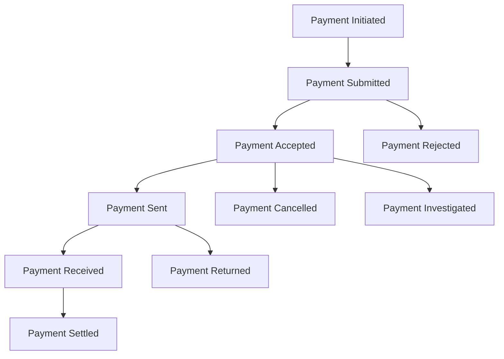
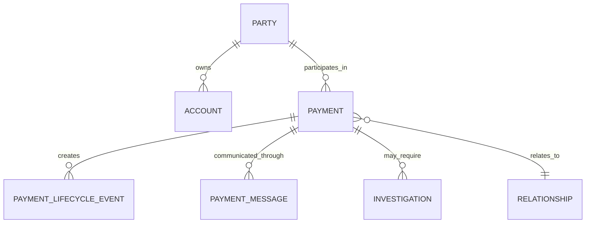

# Conceptual Payment Domain Model

1. Purpose

This document defines the enterprise conceptual payment domain model for the Enterprise Payments AI Platform.

This platform is an AI-enabled enterprise payment intelligence platform. It is not a payment processing engine.

Enterprise data remains the source of truth.

2. Domain Scope

This conceptual model covers the business scope required to support:
- Payment intelligence
- Payment lifecycle visibility
- Payment investigation
- Analytics
- AI-assisted decision support

3. Core Business Concepts

Below are the core conceptual entities and their business meaning and roles in the payment domain.

Payment
- Business meaning: A business-level transfer of value representing an obligation between parties.
- Role: Primary domain object for analytics, reconciliation, investigation and reporting. Payments aggregate one or more message inputs and produce lifecycle events.

Payment Message
- Business meaning: An ISO 20022 message instance that carries instructions, confirmations, status or reporting related to payments.
- Role: Source artifacts that originate or reference Payments. Original messages are preserved for audit and lineage and are used to derive Payments and Events.

Payment Lifecycle Event
- Business meaning: An immutable record describing a state transition, validation result, processing step or operational action applied to a Payment.
- Role: Capture the chronology of a Payment (timestamps, source, agent, reason) for traceability, SLA measurement and investigations.

Party
- Business meaning: An individual, organisation or financial institution that acts as payer, payee or intermediary.
- Role: Principal actors in Payments and Account ownership; used for relationship intelligence and risk analysis.

Account
- Business meaning: A financial ledger reference or account identifier belonging to a Party used to source or receive funds.
- Role: Context for debits/credits, reconciliation and risk; accounts connect Parties to transactional activity.

Organisation
- Business meaning: Legal entities, corporations or business units that may own Parties, Accounts or act as service providers.
- Role: Higher-level grouping for reporting, ownership, compliance and policy application.

Mandate
- Business meaning: Authorisation giving a payee or processor permission to debit or credit a payer's account (e.g., direct debit mandate).
- Role: Governs recurring payments, authorisation checks and lifecycle events (creation, amendment, revocation).

Investigation
- Business meaning: A case or inquiry initiated to resolve exceptions, disputes or compliance issues related to Payments.
- Role: Case management construct that stores evidence, timelines, actions, owners and outcomes linked to Payments, Events and Messages.

Relationship
- Business meaning: A conceptual link between domain entities (e.g., Party-to-Party, Party-to-Account, Payment-to-Batch).
- Role: Enables graph-style reasoning, provenance and impact analysis for investigations and intelligence.

4. Payment Lifecycle Event Model

Payment lifecycle events are first-class business concepts. Events represent discrete, immutable state transitions or actions.

Common lifecycle events (examples):
- Payment Initiated
- Payment Submitted
- Payment Accepted
- Payment Rejected
- Payment Pending
- Payment Released
- Payment Sent
- Payment Received
- Payment Settled
- Payment Returned
- Payment Cancelled
- Payment Investigated
- Payment Closed

Events represent business state transitions and must preserve:
- Event timestamp
- Source reference (message id, system id)
- Lineage (link to originating Raw message and derived Silver entity)
- Author/actor and reason codes (where applicable)

5. Payment Lifecycle Flow

The primary happy-path flow (conceptual):

Alternative paths include rejections, cancellations, returns and investigations which branch the flow and generate Investigation cases and additional Events.

6. ISO 20022 Business Alignment

This conceptual model aligns to ISO 20022 message families at a business level (no field mapping in this document):
- `pain.*` — Payment initiation and customer messages (e.g., `pain.001`, `pain.002`)
- `pacs.*` — Payment clearing and settlement messages (e.g., `pacs.008`)
- `camt.*` — Reporting, investigation and control messages (e.g., `camt.029`, `camt.055`)

Examples referenced for conceptual alignment:
- `pain.001` Customer Credit Transfer Initiation
- `pain.002` Customer Payment Status Report
- `pacs.008` FI to FI Customer Credit Transfer
- `camt.029` Resolution of Investigation
- `camt.055` Payment Cancellation Request

ISO messages are source artifacts that map into conceptual domain entities and will be reconciled and traced in the Silver canonical model.

7. Conceptual Entity Relationship Diagram

8. Design Principles

- Events are first-class domain concepts.
- Payment lineage must be preserved across derivation and transformation.
- Original source messages must remain traceable and auditable.
- AI consumes governed Silver and Gold data; LLM outputs are assistive and not authoritative.
- Silver canonical modelling will be derived from this conceptual model and used for trusted AI and data products.
