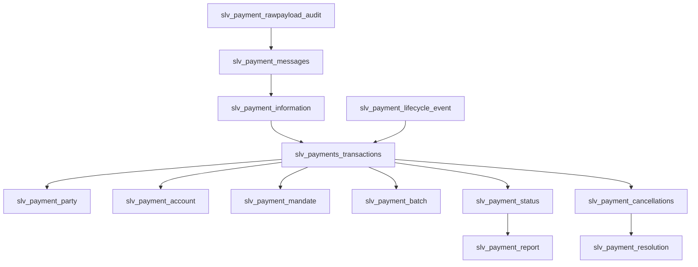

# Silver Canonical Payment Model (SLV)

This document defines the logical Silver canonical payment model for the Enterprise Payments AI Platform. It documents Silver-level canonical entities with the `slv_` prefix and specifies business purpose, primary keys, foreign keys, important business attributes, relationships, ISO 20022 source messages, and lineage requirements.

> Silver is the trusted enterprise payment domain layer between Bronze and Gold. It is a logical contract — not a conceptual model and not a physical implementation.

## Purpose

- **Silver layer responsibility**: Provide canonical, normalized and lineage-driven logical entities that represent payments, messages, events, parties, accounts, mandates, batches, cancellations, and resolution workflows.
- **Enterprise canonical payment representation**: Normalize ISO 20022 and operational feeds into consistent logical records usable by Gold data products, analytics, and AI services.
- **Usage**: Gold models, analytics, and AI agents consume Silver entities as authoritative inputs for analysis, retrieval, and reasoning.

## Scope

Silver covers:
- ISO 20022 aligned payment domain modelling
- Payment lifecycle event history and operational processing history
- Payment status and reporting outputs
- Cancellation and resolution workflows
- Participant and account canonicalisation
- Source lineage and payload audit traceability

## Silver Layer Responsibilities

- **Standardisation**: Map and normalize source structures into canonical logical shapes and controlled vocabularies.
- **Canonicalisation**: Derive enterprise payment semantics from ISO 20022 messages and operational platform events.
- **Data quality enforcement**: Apply logical quality rules and report acceptance metrics.
- **Lineage preservation**: Maintain immutable payload audit evidence and source traceability from raw payload to Silver.
- **Auditability**: Ensure every Silver entity includes ingestion and lineage metadata for compliance and forensic review.

## Source Lineage and Canonicalisation

The Silver lineage flow is anchored on immutable payload audit evidence, ISO 20022 messages, interpreted payment information, and the canonical transaction entity.

```text
slv_payment_rawpayload_audit
        |
        v
slv_payment_messages
        |
        v
slv_payment_information
        |
        v
slv_payments_transactions
```

- `slv_payment_rawpayload_audit` preserves immutable original ISO 20022 payload evidence and ingestion metadata.
- `slv_payment_messages` represents ISO 20022 message instances parsed from source feeds.
- `slv_payment_information` represents interpreted payment instruction and information blocks derived from those messages.
- `slv_payments_transactions` is the canonical enterprise payment transaction.

## Entity Relationship Model

The Silver model is transaction-centric. The central anchor entity is `slv_payments_transactions`. All major business relationships connect directly to it.



## Entity Definitions

Each entity below includes: Purpose, Primary Key, Foreign Keys, Important business attributes, Relationships, and ISO 20022 source messages.

### slv_payments_transactions
- **Purpose**: Canonical enterprise payment transaction record used for reconciliation, reporting, investigation, and analytics.
- **Primary Key**: transaction_id
- **Foreign Keys**:
  - message_id → slv_payment_messages.message_id
  - payment_information_id → slv_payment_information.payment_information_id
  - party_id → slv_payment_party.party_id
  - account_id → slv_payment_account.account_id
  - mandate_id → slv_payment_mandate.mandate_id
  - batch_id → slv_payment_batch.batch_id
  - raw_payload_audit_id → slv_payment_rawpayload_audit.raw_audit_id
- **Important business attributes**: payment_reference, end_to_end_id, instruction_id, amount, currency, value_date, initiation_date, payment_purpose, payment_type, transaction_status_summary
- **Relationships**: Central Silver anchor. Directly relates to party, account, mandate, batch, status, cancellations, lifecycle events, and source lineage entities.
- **ISO 20022 source messages**: pain.001, pacs.008, pain.002 where payment identity is defined.

### slv_payment_rawpayload_audit
- **Purpose**: Preserve immutable original ISO 20022 payload evidence and ingestion metadata.
- **Primary Key**: raw_audit_id
- **Foreign Keys**: none
- **Important business attributes**: ingestion_timestamp, source_system, checksum, storage_pointer, payload_type, file_reference
- **Relationships**: Serves as the immutable source anchor for messages, information, and transaction lineage.
- **ISO 20022 source messages**: Original payloads for pain.*, pacs.*, camt.*

### slv_payment_messages
- **Purpose**: Represent ISO 20022 message instances parsed from raw payloads.
- **Primary Key**: message_id
- **Foreign Keys**:
  - raw_audit_id → slv_payment_rawpayload_audit.raw_audit_id
- **Important business attributes**: message_type, message_identifier, creation_timestamp, sender, receiver, message_reference, source_system
- **Relationships**: Messages feed payment information and are evidence for canonical transactions.
- **ISO 20022 source messages**: pain.*, pacs.*, camt.*

### slv_payment_information
- **Purpose**: Represent interpreted payment information and instruction blocks derived from messages.
- **Primary Key**: payment_information_id
- **Foreign Keys**:
  - message_id → slv_payment_messages.message_id
- **Important business attributes**: instruction_id, payment_information_type, instruction_timestamp, payment_method, payment_scheme
- **Relationships**: Provides interpreted payment context for canonical transactions.
- **ISO 20022 source messages**: payment information blocks from pain.*

### slv_payment_party
- **Purpose**: Canonical representation of payment participants such as debtor, creditor, or financial institutions.
- **Primary Key**: party_id
- **Foreign Keys**: none
- **Important business attributes**: party_name, party_type, legal_identifier, roles, country
- **Relationships**: Directly related to canonical transactions. Represents participant identity in the transaction.
- **ISO 20022 source messages**: Debtor, creditor, and party elements in pain.*, pacs.*, camt.*

### slv_payment_party_address
- **Purpose**: Canonical party address information for compliance and routing.
- **Primary Key**: address_id
- **Foreign Keys**:
  - party_id → slv_payment_party.party_id
- **Important business attributes**: address_lines, city, region, country, postal_code, address_type
- **Relationships**: Linked directly to party records, not to transactions.
- **ISO 20022 source messages**: party address segments in pain.*, pacs.*, camt.*

### slv_payment_account
- **Purpose**: Canonical financial account reference used in payments.
- **Primary Key**: account_id
- **Foreign Keys**: none
- **Important business attributes**: iban, account_number, account_type, currency, bank_identifier, account_status
- **Relationships**: Directly related to canonical transactions. Represents the account context for the transaction.
- **ISO 20022 source messages**: DebtorAgent/CreditorAgent and account elements in pain.*, pacs.*

### slv_payment_mandate
- **Purpose**: Canonical representation of payment authorisations and mandates.
- **Primary Key**: mandate_id
- **Foreign Keys**: none
- **Important business attributes**: mandate_reference, creditor_id, debtor_id, mandate_status, effective_date, expiry_date
- **Relationships**: Directly related to canonical transactions. Represents mandate context for the transaction.
- **ISO 20022 source messages**: direct debit mandate segments in pain.*

### slv_payment_batch
- **Purpose**: Represent grouped payment processing units such as files or business batches.
- **Primary Key**: batch_id
- **Foreign Keys**: none
- **Important business attributes**: batch_reference, file_name, origin_system, processing_window, batch_status
- **Relationships**: Directly related to canonical transactions. Supports reconciliation and grouping.
- **ISO 20022 source messages**: file-level and batch wrapper elements.

### slv_payment_lifecycle_event
- **Purpose**: Canonical record of internal technical processing history for payments.
- **Primary Key**: lifecycle_event_id
- **Foreign Keys**:
  - transaction_id → slv_payments_transactions.transaction_id
- **Important business attributes**: event_type, event_timestamp, source_system, technical_status, source_event_id, processing_step
- **Relationships**: Captures technical processing history from CPO/PLM and VPM/PMN platforms for canonical transactions.
- **ISO 20022 source messages**: Typically not directly ISO 20022; aligns with technical processing platforms and internal event feeds.

### slv_payment_status
- **Purpose**: Canonical business payment status history.
- **Primary Key**: status_id
- **Foreign Keys**:
  - transaction_id → slv_payments_transactions.transaction_id
- **Important business attributes**: status_code, status_reason, effective_timestamp, status_source, status_scope
- **Relationships**: Represents business payment status linked to canonical transactions.
- **ISO 20022 source messages**: pain.002, pacs status messages where applicable

### slv_payment_report
- **Purpose**: Canonical representation of reporting outputs and reconciliation messages.
- **Primary Key**: report_id
- **Foreign Keys**:
  - status_id → slv_payment_status.status_id
- **Important business attributes**: report_type, report_timestamp, reconciliation_status, report_reference
- **Relationships**: Represents reporting outputs created from payment status and transaction context.
- **ISO 20022 source messages**: camt reporting messages and status-related reporting outputs

### slv_payment_cancellations
- **Purpose**: Canonical capture of cancellation requests and outcomes.
- **Primary Key**: cancellation_id
- **Foreign Keys**:
  - transaction_id → slv_payments_transactions.transaction_id
- **Important business attributes**: cancellation_timestamp, cancellation_reason, cancellation_status, source_reference
- **Relationships**: Captures cancellations linked to canonical transactions and feeds resolution workflows.
- **ISO 20022 source messages**: camt.055 and other cancellation-related messages

### slv_payment_resolution
- **Purpose**: Canonical representation of investigation resolutions and outcomes.
- **Primary Key**: resolution_id
- **Foreign Keys**:
  - cancellation_id → slv_payment_cancellations.cancellation_id
- **Important business attributes**: resolution_status, resolution_timestamp, resolution_notes, assigned_owner
- **Relationships**: Represents the outcome of cancellation resolution workflows.
- **ISO 20022 source messages**: camt.029 and related resolution reporting messages

## Lifecycle Event Source Consolidation

Internal lifecycle events are consolidated from two platform sources into the canonical Silver lifecycle entity:

```text
slv_cpo_plm_lifecycle_event
              |
              |
           UNION ALL
              |
              v
slv_payment_lifecycle_event
              ^
              |
           UNION ALL
              |
slv_vpm_pmn_lifecycle_event
```

- `slv_payment_lifecycle_event` provides technical processing history from CPO/PLM and VPM/PMN platforms.
- These lifecycle events attach to canonical transactions, not to business payment status.

## Approved Silver Architectural Rules

- The Silver anchor entity is `slv_payments_transactions`. There is no `slv_payment` entity.
- All major business relationships anchor around `slv_payments_transactions`.
- `slv_payment_lifecycle_event` represents internal technical processing history, not business payment status.
- `slv_payment_status` represents business payment status, and `slv_payment_report` represents reporting outputs.
- Cancellation requests create resolution workflows: `slv_payments_transactions -> slv_payment_cancellations -> slv_payment_resolution`.
- `slv_payment_rawpayload_audit` preserves immutable payload evidence and supports lineage into messages, payment information, and transactions.

## Notes

- ISO 20022 payments contain debtor, creditor, account, and mandate relationships. In Silver, these relationships are modeled by direct links from `slv_payments_transactions` to `slv_payment_party`, `slv_payment_account`, `slv_payment_mandate`, and `slv_payment_batch`.
- The lifecycle event model consolidates technical events from CPO/PLM and VPM/PMN into `slv_payment_lifecycle_event`, which attaches to canonical transactions rather than representing business status.
- This document remains a logical Silver canonical model only. It does not define SQL, physical Iceberg tables, or physical implementation artifacts.
