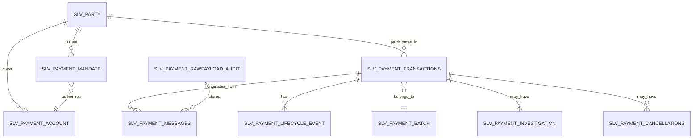
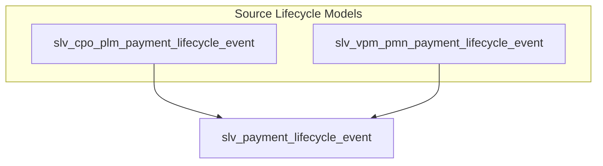

# Silver Canonical Payment Model (SLV)

This document defines the logical Silver canonical payment model for the Enterprise Payments AI Platform. It documents Silver-level canonical entities with the `slv_` prefix and describes business purpose, grain, keys, canonical attributes, relationships, ISO 20022 alignment and lineage requirements.

> Silver is the trusted enterprise payment domain layer between Bronze and Gold. It is a logical contract — not a conceptual model and not a physical implementation.

## Purpose

- **Silver layer responsibility**: Provide canonical, cleaned and standardised logical records that represent payments, messages, events, parties, accounts and supporting artefacts.
- **Enterprise canonical payment representation**: Normalize ISO 20022 and operational feeds into consistent records usable by Gold data products, analytics and AI services.
- **Usage**: Gold models, BI, and AI agents consume Silver entities as authoritative inputs for analysis, retrieval and reasoning.

## Scope

Silver covers:
- ISO 20022 aligned payment domain modelling
- Payment lifecycle events and consolidated event history
- Payment lineage and provenance (raw → bronze → silver)
- Investigation capability and evidence references
- Relationship modelling for parties, accounts and mandates

## Silver Layer Responsibilities

- **Standardisation**: Map and normalise source structures into canonical shapes and controlled vocabularies.
- **Canonicalisation**: Derive domain semantics from message-level constructs.
- **Data quality enforcement**: Apply logical quality rules and report metrics for acceptance.
- **Lineage preservation**: Maintain pointers to Raw Payload Audit and Bronze artifacts to enable traceability.
- **Auditability**: Ensure every record includes ingestion metadata for compliance and forensic review.

## Payment Core Entities (slv_*)

For each entity below the required documentation sections are provided: Business Purpose, Grain, Business Keys, Canonical Attributes (logical), Relationships, ISO 20022 Alignment, Lineage.

### slv_payment_transactions
- Business Purpose: Canonical payment transaction representation — the business transaction unit used for reconciliation, reporting and investigation.
- Grain: One row per canonical payment transaction (economic transfer unit).
- Business Keys: payment_reference, end_to_end_id, instruction_id, correlation_id
- Canonical Attributes: amount, currency, value_date, initiation_date, payment_purpose, payment_type, status_summary
- Relationships: linked to `slv_payment_messages`, `slv_payment_lifecycle_event`, `slv_payment_party`, `slv_payment_account`, `slv_payment_batch`, `slv_payment_mandate`, `slv_payment_cancellations`, `slv_payment_resolution`
- ISO 20022 Alignment: pain.001, pacs.008, pain.002 (status updates)
- Lineage: must reference raw_payload_audit ids and bronze source ids; preserve original identifiers and ingestion timestamps

### slv_payment_messages
- Business Purpose: Store logical representation and metadata for ISO 20022 messages ingested into the system.
- Grain: One row per source message instance.
- Business Keys: message_id, file_id, correlation_id
- Canonical Attributes: message_type, message_identifier, creation_timestamp, source_system, sender, receiver, original_message_reference
- Relationships: originates `slv_payment_transactions`, references `slv_payment_lifecycle_event`, linked to `slv_payment_rawpayload_audit`
- ISO 20022 Alignment: pain.*, pacs.*, camt.*
- Lineage: pointer to raw payload audit and bronze message artefacts

### slv_payment_information
- Business Purpose: Grouping of payment instructions and instruction-level context (e.g., instruction block within a file or message that groups payments).
- Grain: One row per payment information/instruction grouping.
- Business Keys: instruction_id, payment_information_id
- Canonical Attributes: instruction_source, instruction_timestamp, instruction_status, instruction_notes
- Relationships: groups `slv_payment_transactions`, linked to `slv_payment_messages`, may link to `slv_payment_batch`
- ISO 20022 Alignment: elements within pain.* that represent payment information blocks
- Lineage: reference to originating message ids and raw payload audit

### slv_payment_batch
- Business Purpose: Represent grouped payment processing units (file, clearing run, business batch).
- Grain: One row per batch.
- Business Keys: batch_reference, file_name
- Canonical Attributes: batch_timestamp, origin_system, processing_window, batch_status
- Relationships: contains `slv_payment_transactions`, contains `slv_payment_messages`
- ISO 20022 Alignment: file-level wrappers, transport metadata
- Lineage: list of constituent raw message ids and bronze batch references

## Lifecycle and Status

### slv_payment_lifecycle_event
- Business Purpose: Canonical event log capturing state transitions and processing actions for payments consolidated from multiple source lifecycle feeds.
- Grain: One row per lifecycle event.
- Business Keys: event_id, correlation_id
- Canonical Attributes: event_type, event_timestamp, event_source, event_reason, actor, event_metadata
- Relationships: belongs to `slv_payment_transactions`, may reference `slv_payment_messages`, may reference `slv_payment_resolution` or `slv_payment_cancellations`
- ISO 20022 Alignment: pain.002, camt.029, camt.055 where events are represented
- Lineage: must include pointers to source lifecycle events and raw message ids

Important design rule:

There are multiple source lifecycle models in the ecosystem with different origins and semantics:

- `slv_cpo_plm_payment_lifecycle_event`: lifecycle events produced by the core processing orchestration (CPO/PLM) for internal processing stages.
- `slv_vpm_pmn_payment_lifecycle_event`: lifecycle events produced by external vendor/process management (VPM/PMN) or message-level processors.

Canonical consolidation approach:

```
slv_payment_lifecycle_event = UNION ALL (
    slv_cpo_plm_payment_lifecycle_event
    +
    slv_vpm_pmn_payment_lifecycle_event
)
```

Why multiple source lifecycle models exist:
- Different processing systems emit lifecycle events in their native formats. Consolidation ensures a single, auditable chronological event stream per payment while preserving original source context.

Canonical lifecycle event attributes (logical):
- event_id, correlation_id, event_type, event_timestamp, event_source, source_event_id, actor, reason_code, metadata

Event timestamp rules:
- Prefer source-provided event timestamp; if absent, use ingestion timestamp with provenance flag indicating derived timestamp.
- All timestamps must be stored in UTC and carry source timezone metadata if provided.

Event ordering rules:
- Canonical ordering is performed by `event_timestamp` then by `source_event_id` (stable tiebreaker) to ensure deterministic ordering.

Correlation rules:
- Use correlation_id (e.g., end_to_end_id or business correlation id) to link events to `slv_payment_transactions`. When correlation is missing, fallback to matching rules (account, amount, timestamp window) and mark with confidence score.

Lineage preservation:
- Each canonical event must retain source_event_id, source_system and raw_payload_audit references to enable full traceability to the original message.

### slv_payment_status
- Business Purpose: Canonical payment status history capturing status changes and effective timestamps.
- Grain: One row per status change per payment.
- Business Keys: status_id, correlation_id
- Canonical Attributes: status_code, status_reason, effective_timestamp, source_reference, actor
- Relationships: points to `slv_payment_transactions`, references `slv_payment_lifecycle_event`
- ISO 20022 Alignment: status information from pain.002 and other status-reporting messages
- Lineage: source message and raw payload pointers

## Party and Account Domain

### slv_payment_party
- Business Purpose: Canonical representation of individuals, organisations and financial institutions participating in payments.
- Grain: One row per canonical party.
- Business Keys: party_id, legal_identifier (LEI, tax id)
- Canonical Attributes: party_name, party_type, legal_identifier, roles
- Relationships: owns `slv_payment_account`, participates in `slv_payment_transactions`, linked to `slv_payment_mandate`
- ISO 20022 Alignment: party elements in pain/pacs/camt
- Lineage: source claim references and confidence/merge provenance

### slv_payment_party_address
- Business Purpose: Address records for parties for compliance and routing.
- Grain: One row per party-address association (effective date scoped).
- Business Keys: address_id, party_id
- Canonical Attributes: address_lines, city, region, country, postal_code, address_type, effective_from, effective_to
- Relationships: belongs to `slv_payment_party`
- ISO 20022 Alignment: party/address segments
- Lineage: source occurrence references

### slv_payment_account
- Business Purpose: Canonical financial account references used in payments.
- Grain: One row per account.
- Business Keys: account_id, IBAN, account_number
- Canonical Attributes: account_type, currency, bank_identifier, status
- Relationships: owned by `slv_payment_party`, used by `slv_payment_transactions`
- ISO 20022 Alignment: account elements in pain/pacs
- Lineage: source assertions and ingestion provenance

### slv_payment_mandate
- Business Purpose: Canonical representation of authorisations for payments (e.g., direct debit mandates).
- Grain: One row per mandate.
- Business Keys: mandate_id, creditor_id, debtor_id
- Canonical Attributes: mandate_status, effective_date, expiry_date, mandate_scope
- Relationships: attached to `slv_payment_account`, linked to `slv_payment_transactions` when applicable
- ISO 20022 Alignment: direct debit segments where present
- Lineage: original mandate evidence and change history

## Investigation and Resolution

### slv_payment_cancellations
- Business Purpose: Canonical capture of cancellation requests and outcomes.
- Grain: One row per cancellation request.
- Business Keys: cancellation_id, related_payment_id
- Canonical Attributes: cancellation_timestamp, cancellation_reason, outcome, source_reference
- Relationships: linked to `slv_payment_transactions`, `slv_payment_messages`, `slv_payment_lifecycle_event`
- ISO 20022 Alignment: camt.055
- Lineage: link to originating cancellation message and raw payload

### slv_payment_resolution
- Business Purpose: Canonical representation of investigation resolutions and outcomes.
- Grain: One row per resolution action/outcome.
- Business Keys: resolution_id, investigation_id
- Canonical Attributes: resolution_status, resolution_timestamp, resolution_notes, assigned_owner
- Relationships: references `slv_payment_cancellations`, `slv_payment_lifecycle_event`, `slv_payment_transactions`
- ISO 20022 Alignment: camt.029 and related reporting messages
- Lineage: pointer to evidence and raw payload

### slv_payment_report
- Business Purpose: Stores reporting messages, statements and reconciliation artifacts.
- Grain: One row per report message or reconciliation artifact.
- Business Keys: report_id, message_id
- Canonical Attributes: report_type, report_timestamp, reconciliation_status, report_metadata
- Relationships: linked to `slv_payment_transactions`, `slv_payment_batch`
- ISO 20022 Alignment: camt.* reporting messages
- Lineage: reference to source report payloads

## Audit and Lineage

### slv_payment_rawpayload_audit
- Business Purpose: Immutable audit of ingested raw payloads and ingestion metadata.
- Grain: One row per ingested raw payload (file/message).
- Business Keys: raw_audit_id, message_id, file_id
- Canonical Attributes: ingestion_timestamp, source_system, checksum, storage_pointer, retention_policy
- Relationships: referenced by `slv_payment_messages`, `slv_payment_lifecycle_event`, `slv_payment_transactions`
- ISO 20022 Alignment: original message payloads (pain/pacs/camt)
- Lineage: provides the immutable anchor for Silver derivations

## Required Documentation For Every Entity

Each Silver entity must include the following documentation fields (logical only):
- **Business Purpose**: Why the entity exists.
- **Grain**: The level of uniqueness (row grain).
- **Business Keys**: Natural identifiers from source systems.
- **Canonical Attributes**: Logical attributes (no physical types).
- **Relationships**: Relationships to other Silver entities.
- **ISO 20022 Alignment**: Relevant message families (pain.*, pacs.*, camt.*).
- **Lineage**: Relationship showing Raw → Bronze → Silver → Gold → AI consumption.

## Required Diagrams

### 1. Silver canonical domain ER diagram



### 2. Payment lifecycle event consolidation diagram



### 3. Silver-to-Gold consumption flow

```mermaid
flowchart LR
    RAW[Raw Payloads] --> BRONZE[Bronze (parsed/messages)] --> SILV[Silver Canonical Models]
    SILV --> GOLD[Gold Dimensional Models / Data Products]
    SILV --> AI[AI Consumption (Retrieval, Agents)]
```

---

Notes:
- Silver is the trusted enterprise payment domain. Gold is analytics. AI consumes governed Silver and Gold. LLMs are not the source of truth.
- This document defines logical Silver entities and lineage requirements only — no SQL, Iceberg tables, dbt models or other implementation artifacts are included.
