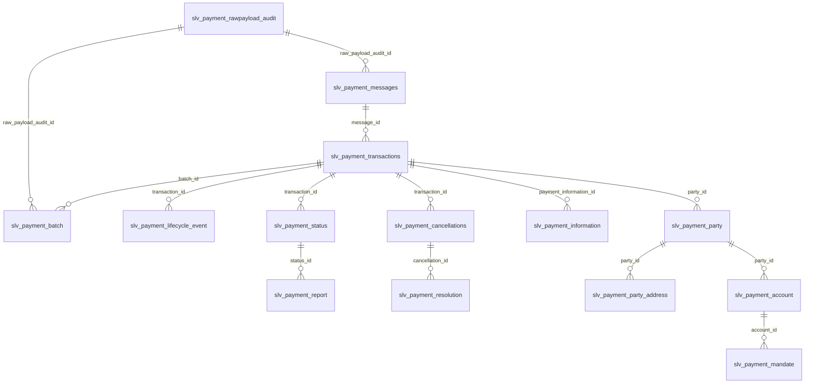
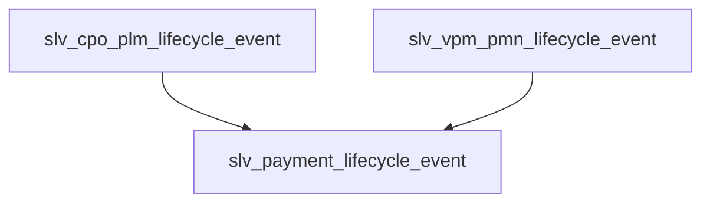

# Silver Canonical Payment Model (SLV)

This document defines the logical Silver canonical payment model for the Enterprise Payments AI Platform. It documents Silver-level canonical entities with the `slv_` prefix and specifies business purpose, grain, keys, canonical attributes, relationships, ISO 20022 alignment, and lineage requirements.

> Silver is the trusted enterprise payment domain layer between Bronze and Gold. It is a logical contract — not a conceptual model and not a physical implementation.

## Purpose

- **Silver layer responsibility**: Provide canonical, normalized and lineage-driven logical entities that represent payments, messages, events, parties, accounts and supporting artefacts.
- **Enterprise canonical payment representation**: Normalize ISO 20022 and operational feeds into consistent records usable by Gold data products, analytics and AI services.
- **Usage**: Gold models, analytics views and AI agents consume Silver entities as authoritative inputs for analysis, retrieval and reasoning.

## Scope

Silver covers:
- ISO 20022-aligned payment domain modelling
- Payment lifecycle events and consolidated event history
- Payment lineage and provenance (raw → bronze → silver)
- Investigation capability and evidence references
- Relationship modelling for parties, accounts and mandates

## Silver Layer Responsibilities

- **Standardisation**: Map and normalize source structures into canonical logical shapes and controlled vocabularies.
- **Canonicalisation**: Derive domain semantics from message-level constructs.
- **Data quality enforcement**: Apply logical quality rules and report metrics for acceptance.
- **Lineage preservation**: Maintain pointers to Raw Payload Audit and Bronze artifacts to enable traceability.
- **Auditability**: Ensure every Silver record includes ingestion metadata for compliance and forensic review.

## Entity Relationship Model

The Silver model is transaction-centric. The central Silver anchor entity is `slv_payment_transactions`. All other Silver entities connect through explicit PK/FK relationships, with transaction identity preserved as the heart of the Silver canonical layer.



## Payment Core Entities (slv_*)

Each entity below includes: Grain, Primary Key, Foreign Keys, Business Purpose, Relationship description, ISO 20022 Alignment, and Lineage.

### slv_payment_transactions
- **Grain:** One row per canonical payment transaction.
- **Primary Key:** transaction_id
- **Foreign Keys:**
  - message_id → slv_payment_messages.message_id
  - batch_id → slv_payment_batch.batch_id
  - payment_information_id → slv_payment_information.payment_information_id
  - raw_payload_audit_id → slv_payment_rawpayload_audit.raw_audit_id
  - party_id → slv_payment_party.party_id
  - account_id → slv_payment_account.account_id
  - mandate_id → slv_payment_mandate.mandate_id
- **Business Purpose:** Canonical payment transaction representation — the business transaction unit used for reconciliation, reporting and investigation.
- **Relationship description:** Central anchor entity. Transactions provide canonical payment identity and link messages, status, lifecycle events, parties, accounts, batches and audit artifacts.
- **ISO 20022 Alignment:** pain.001, pacs.008, pain.002 (status updates)
- **Lineage:** Must reference raw_payload_audit ids and bronze source ids; preserve original identifiers and ingestion timestamps.

### slv_payment_messages
- **Grain:** One row per ingested payment message.
- **Primary Key:** message_id
- **Foreign Keys:**
  - raw_payload_audit_id → slv_payment_rawpayload_audit.raw_audit_id
- **Business Purpose:** Store logical representation and metadata for ISO 20022 messages ingested into the system.
- **Relationship description:** Messages provide evidence and lineage for transactions and lifecycle events. A transaction may originate from one or multiple messages.
- **ISO 20022 Alignment:** pain.*, pacs.*, camt.*
- **Lineage:** Pointer to raw payload audit and bronze message artefacts.

### slv_payment_information
- **Grain:** One row per payment instruction block.
- **Primary Key:** payment_information_id
- **Foreign Keys:**
  - message_id → slv_payment_messages.message_id
- **Business Purpose:** Grouping of payment instructions and instruction-level context.
- **Relationship description:** Provides instruction context for transactions, linking multiple payments to a common instruction block.
- **ISO 20022 Alignment:** payment information blocks in pain.*
- **Lineage:** Reference to originating message ids and raw payload audit.

### slv_payment_batch
- **Grain:** One row per payment batch or file.
- **Primary Key:** batch_id
- **Foreign Keys:**
  - raw_payload_audit_id → slv_payment_rawpayload_audit.raw_audit_id
- **Business Purpose:** Represent grouped payment processing units (file, clearing run, business batch).
- **Relationship description:** Batch organizes transactions into processing groups and supports reconciliation.
- **ISO 20022 Alignment:** file-level wrappers and transport metadata
- **Lineage:** List of constituent raw message ids and bronze batch references.

## Lifecycle and Status

### slv_payment_lifecycle_event
- **Grain:** One row per canonical lifecycle event for a transaction.
- **Primary Key:** lifecycle_event_id
- **Foreign Keys:**
  - transaction_id → slv_payment_transactions.transaction_id
  - message_id → slv_payment_messages.message_id
- **Business Purpose:** Canonical event log capturing state transitions and processing actions for payments.
- **Relationship description:** Lifecycle events provide immutable history for transactions and are traceable back to source messages.
- **ISO 20022 Alignment:** pain.002, camt.029, camt.055 where events are represented
- **Lineage:** Must include pointers to source lifecycle events and raw payload ids.

There are multiple operational lifecycle sources:
- `slv_cpo_plm_lifecycle_event` (CPO PLM operational domain)
- `slv_vpm_pmn_lifecycle_event` (VPM/PMN operational domain)

These source feeds are consolidated into the canonical Silver lifecycle entity:

```text
slv_payment_lifecycle_event = UNION ALL (
  slv_cpo_plm_lifecycle_event
  +
  slv_vpm_pmn_lifecycle_event
)
```

### slv_payment_status
- **Grain:** One row per payment status observation.
- **Primary Key:** status_id
- **Foreign Keys:**
  - transaction_id → slv_payment_transactions.transaction_id
  - lifecycle_event_id → slv_payment_lifecycle_event.lifecycle_event_id
  - message_id → slv_payment_messages.message_id
- **Business Purpose:** Canonical payment status history capturing status changes and effective timestamps.
- **Relationship description:** Status records document evolving payment state and link to transaction and lifecycle event history.
- **ISO 20022 Alignment:** status reporting from pain.002 and related messages
- **Lineage:** Source message and raw payload pointers.

### slv_payment_report
- **Grain:** One row per payment report or reconciliation artifact.
- **Primary Key:** report_id
- **Foreign Keys:**
  - transaction_id → slv_payment_transactions.transaction_id
  - status_id → slv_payment_status.status_id
  - batch_id → slv_payment_batch.batch_id
  - message_id → slv_payment_messages.message_id
- **Business Purpose:** Stores reporting messages, statements and reconciliation artifacts.
- **Relationship description:** Reports provide evidence and reconciliation context for transactions, status history and batches.
- **ISO 20022 Alignment:** camt.* reporting messages
- **Lineage:** Reference to source report payloads.

## Party and Account Domain

### slv_payment_party
- **Grain:** One row per canonical party.
- **Primary Key:** party_id
- **Foreign Keys:** none
- **Business Purpose:** Canonical representation of individuals, organisations and financial institutions participating in payments.
- **Relationship description:** Parties anchor ownership and participation for accounts and transactions.
- **ISO 20022 Alignment:** party elements in pain/pacs/camt
- **Lineage:** Source claim references and confidence/merge provenance.

### slv_payment_party_address
- **Grain:** One row per party address.
- **Primary Key:** address_id
- **Foreign Keys:**
  - party_id → slv_payment_party.party_id
- **Business Purpose:** Address records for parties for compliance and routing.
- **Relationship description:** Addresses support party identity and compliance use cases.
- **ISO 20022 Alignment:** party/address segments
- **Lineage:** Source occurrence references.

### slv_payment_account
- **Grain:** One row per canonical payment account.
- **Primary Key:** account_id
- **Foreign Keys:**
  - party_id → slv_payment_party.party_id
- **Business Purpose:** Canonical financial account references used in payments.
- **Relationship description:** Accounts connect parties to transactions and mandates.
- **ISO 20022 Alignment:** account elements in pain/pacs
- **Lineage:** Source assertions and ingestion provenance.

### slv_payment_mandate
- **Grain:** One row per canonical mandate.
- **Primary Key:** mandate_id
- **Foreign Keys:**
  - account_id → slv_payment_account.account_id
- **Business Purpose:** Canonical representation of authorisations for payments (e.g., direct debit mandates).
- **Relationship description:** Mandates authorize payments on behalf of account holders.
- **ISO 20022 Alignment:** direct debit segments where present
- **Lineage:** Original mandate evidence and change history.

## Investigation and Resolution

### slv_payment_cancellations
- **Grain:** One row per payment cancellation event.
- **Primary Key:** cancellation_id
- **Foreign Keys:**
  - transaction_id → slv_payment_transactions.transaction_id
  - message_id → slv_payment_messages.message_id
  - status_id → slv_payment_status.status_id
- **Business Purpose:** Canonical capture of cancellation requests and outcomes.
- **Relationship description:** Cancellation records link payment transactions, status history and source messages.
- **ISO 20022 Alignment:** camt.055
- **Lineage:** Link to originating cancellation message and raw payload.

### slv_payment_resolution
- **Grain:** One row per investigation resolution.
- **Primary Key:** resolution_id
- **Foreign Keys:**
  - transaction_id → slv_payment_transactions.transaction_id
  - cancellation_id → slv_payment_cancellations.cancellation_id
  - lifecycle_event_id → slv_payment_lifecycle_event.lifecycle_event_id
  - message_id → slv_payment_messages.message_id
- **Business Purpose:** Canonical representation of investigation resolutions and outcomes.
- **Relationship description:** Resolution records capture outcomes and link to cancellations, lifecycle events and transactions.
- **ISO 20022 Alignment:** camt.029 and related reporting messages
- **Lineage:** Pointer to evidence and raw payload.

## Audit and Lineage

### slv_payment_rawpayload_audit
- **Grain:** One row per raw payload ingestion audit record.
- **Primary Key:** raw_audit_id
- **Foreign Keys:** none
- **Business Purpose:** Immutable audit of ingested raw payloads and ingestion metadata.
- **Relationship description:** Raw payload audit anchors lineage for Silver derivations and provides immutable source validation.
- **ISO 20022 Alignment:** original message payloads (pain/pacs/camt)
- **Lineage:** Provides the immutable anchor for Silver derivations.

## Required Documentation For Every Entity

Each Silver entity must include the following documentation fields (logical only):
- **Business Purpose:** Why the entity exists.
- **Grain:** The row uniqueness level.
- **Primary Key:** The entity's PK.
- **Foreign Keys:** References to related Silver entities.
- **Relationship description:** How the entity connects within Silver.
- **ISO 20022 Alignment:** Relevant message families (pain.*, pacs.*, camt.*).
- **Lineage:** Relationship showing Raw → Bronze → Silver → Gold → AI consumption.

## Required Diagrams

### 1. Silver canonical domain ER diagram


### 2. Payment lifecycle event consolidation diagram



### 3. Silver-to-Gold consumption flow

```mermaid
flowchart LR
    RAW[Raw Payloads] --> BRONZE[Bronze (parsed/messages)] --> SILV[Silver Canonical Models]
    SILV --> GOLD[Gold Dimensional Models / Data Products]
    SILV --> AI[AI Consumption (Retrieval, Agents)]
```

---

Notes:
- Silver is the trusted enterprise payment domain. Gold is analytics. AI consumes governed Silver and Gold. LLMs are not the source of truth.
- This document defines logical Silver entities and lineage requirements only — no SQL, Iceberg tables, dbt models or other implementation artifacts are included.
