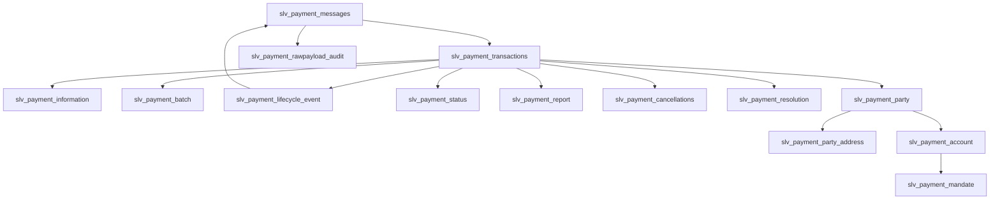

# Silver Canonical Payment Model (SLV)

This document defines the logical Silver canonical payment model for the Enterprise Payments AI Platform. It documents Silver-level canonical entities with the `slv_` prefix and describes business purpose, grain, keys, canonical attributes, relationships, ISO 20022 alignment and lineage requirements.

> Silver is the trusted enterprise payment domain layer between Bronze and Gold. It is a logical contract — not a conceptual model and not a physical implementation.

## Purpose

- **Silver layer responsibility**: Provide canonical, normalized and lineage-driven logical entities that represent payments, messages, events, parties, accounts and supporting artefacts.
- **Enterprise canonical payment representation**: Normalize ISO 20022 and operational feeds into consistent records usable by Gold data products, analytics and AI services.
- **Usage**: Gold models, analytics views and AI agents consume Silver entities as authoritative inputs for analysis, retrieval and reasoning.

## Scope

Silver covers:
- ISO 20022 aligned payment domain modelling
- Payment lifecycle events and consolidated event history
- Payment lineage and provenance (raw → bronze → silver)
- Investigation capability and evidence references
- Relationship modelling for parties, accounts and mandates

## Silver Layer Responsibilities

- **Standardisation**: Map and normalize source structures into canonical logical shapes and controlled vocabularies.
- **Canonicalisation**: Derive domain semantics from message-level constructs.
- **Data quality enforcement**: Apply logical quality rules and report metrics for acceptance.
- **Lineage preservation**: Maintain pointers to Raw Payload Audit and Bronze artifacts to enable traceability.
- **Auditability**: Ensure every Silver record includes ingestion metadata for compliance and forensic review.

## Entity Relationship Model

The central Silver anchor entity is `slv_payment_transactions`. All other Silver entities relate to it through clear PK/FK relationships.



## Payment Core Entities (slv_*)

Each entity below includes: Primary Key, Foreign Keys, Business Purpose, Relationship description, Business Keys, Canonical Attributes, ISO 20022 Alignment, and Lineage.

### slv_payment_transactions
**Primary Key:** transaction_id
**Foreign Keys:**
- message_id → slv_payment_messages.message_id
- batch_id → slv_payment_batch.batch_id
- payment_information_id → slv_payment_information.payment_information_id
- raw_payload_audit_id → slv_payment_rawpayload_audit.raw_audit_id
- party_id → slv_payment_party.party_id
- account_id → slv_payment_account.account_id
- mandate_id → slv_payment_mandate.mandate_id

- **Business Purpose:** Canonical payment transaction representation — the business transaction unit used for reconciliation, reporting and investigation.
- **Relationship description:** Central anchor entity. Transactions provide canonical payment identity and link payment messages, status, lifecycle events, parties, accounts, batches and audit artifacts.
- **Business Keys:** payment_reference, end_to_end_id, instruction_id, correlation_id
- **Canonical Attributes:** amount, currency, value_date, initiation_date, payment_purpose, payment_type, status_summary
- **ISO 20022 Alignment:** pain.001, pacs.008, pain.002 (status updates)
- **Lineage:** Must reference raw_payload_audit ids and bronze source ids; preserve original identifiers and ingestion timestamps.

### slv_payment_messages
**Primary Key:** message_id
**Foreign Keys:**
- raw_payload_audit_id → slv_payment_rawpayload_audit.raw_audit_id

- **Business Purpose:** Store logical representation and metadata for ISO 20022 messages ingested into the system.
- **Relationship description:** Messages provide evidence and lineage for transactions and lifecycle events. Messages are the source-level artefacts from which canonical transaction identity and event history are derived.
- **Business Keys:** message_id, file_id, correlation_id
- **Canonical Attributes:** message_type, message_identifier, creation_timestamp, source_system, sender, receiver, original_message_reference
- **ISO 20022 Alignment:** pain.*, pacs.*, camt.*
- **Lineage:** Pointer to raw payload audit and bronze message artefacts.

### slv_payment_information
**Primary Key:** payment_information_id
**Foreign Keys:**
- message_id → slv_payment_messages.message_id

- **Business Purpose:** Grouping of payment instructions and instruction-level context.
- **Relationship description:** Provides instruction context for transactions, linking multiple payments to a common instruction block.
- **Business Keys:** instruction_id, payment_information_id
- **Canonical Attributes:** instruction_source, instruction_timestamp, instruction_status, instruction_notes
- **ISO 20022 Alignment:** elements within pain.* representing payment information blocks
- **Lineage:** Reference to originating message ids and raw payload audit.

### slv_payment_batch
**Primary Key:** batch_id
**Foreign Keys:**
- raw_payload_audit_id → slv_payment_rawpayload_audit.raw_audit_id

- **Business Purpose:** Represent grouped payment processing units (file, clearing run, business batch).
- **Relationship description:** Batch organizes transactions into processing groups and supports reconciliation.
- **Business Keys:** batch_reference, file_name
- **Canonical Attributes:** batch_timestamp, origin_system, processing_window, batch_status
- **ISO 20022 Alignment:** file-level wrappers, transport metadata
- **Lineage:** List of constituent raw message ids and bronze batch references.

## Lifecycle and Status

### slv_payment_lifecycle_event
**Primary Key:** lifecycle_event_id
**Foreign Keys:**
- transaction_id → slv_payment_transactions.transaction_id
- message_id → slv_payment_messages.message_id

- **Business Purpose:** Canonical event log capturing state transitions and processing actions for payments consolidated from multiple source lifecycle feeds.
- **Relationship description:** Events provide immutable history for transactions and are traceable back to the originating payment message evidence.
- **Business Keys:** lifecycle_event_id, correlation_id
- **Canonical Attributes:** previous_state, new_state, event_timestamp, source_system, source_event_id, reason_code, correlation_id, actor, event_metadata
- **ISO 20022 Alignment:** pain.002, camt.029, camt.055 where events are represented
- **Lineage:** Must include pointers to source lifecycle events and raw message ids.

There are multiple operational lifecycle sources:
- `slv_cpo_plm_lifecycle_event` (CPO PLM operational domain)
- `slv_vpm_pmn_lifecycle_event` (VPM/PMN operational domain)

These sources are consolidated as:

```text
slv_payment_lifecycle_event = UNION ALL (
  slv_cpo_plm_lifecycle_event
  +
  slv_vpm_pmn_lifecycle_event
)
```

- **Why multiple source lifecycle models exist:** Different operational domains emit lifecycle events in their native formats; consolidation creates a single canonical event stream.
- **Event timestamp rules:** Prefer source event timestamp; if absent, use ingestion timestamp with provenance metadata.
- **Event ordering rules:** Order by `event_timestamp` then `source_event_id` for deterministic sequence.
- **Correlation rules:** Use `correlation_id` to link events to transactions; fallback to matching rules when missing.
- **Lineage preservation:** Events retain `source_event_id`, `source_system`, and raw payload references.

### slv_payment_status
**Primary Key:** status_id
**Foreign Keys:**
- transaction_id → slv_payment_transactions.transaction_id
- lifecycle_event_id → slv_payment_lifecycle_event.lifecycle_event_id

- **Business Purpose:** Canonical payment status history capturing status changes and effective timestamps.
- **Relationship description:** Status records document evolving payment state and link to transaction and lifecycle event history.
- **Business Keys:** status_id, correlation_id
- **Canonical Attributes:** status_code, status_reason, effective_timestamp, source_reference, actor
- **ISO 20022 Alignment:** status information from pain.002 and other status-reporting messages
- **Lineage:** Source message and raw payload pointers.

### slv_payment_report
**Primary Key:** report_id
**Foreign Keys:**
- transaction_id → slv_payment_transactions.transaction_id
- batch_id → slv_payment_batch.batch_id

- **Business Purpose:** Stores reporting messages, statements and reconciliation artifacts.
- **Relationship description:** Reports provide downstream evidence and reconciliation context for transactions and batches.
- **Business Keys:** report_id, message_id
- **Canonical Attributes:** report_type, report_timestamp, reconciliation_status, report_metadata
- **ISO 20022 Alignment:** camt.* reporting messages
- **Lineage:** Reference to source report payloads.

## Party and Account Domain

### slv_payment_party
**Primary Key:** party_id
**Foreign Keys:**
- none directly in Silver; may be linked through account or transaction references

- **Business Purpose:** Canonical representation of individuals, organisations and financial institutions participating in payments.
- **Relationship description:** Parties anchor ownership and participation for accounts and transactions.
- **Business Keys:** party_id, legal_identifier (LEI, tax id)
- **Canonical Attributes:** party_name, party_type, legal_identifier, roles
- **ISO 20022 Alignment:** party elements in pain/pacs/camt
- **Lineage:** Source claim references and confidence/merge provenance.

### slv_payment_party_address
**Primary Key:** address_id
**Foreign Keys:**
- party_id → slv_payment_party.party_id

- **Business Purpose:** Address records for parties for compliance and routing.
- **Relationship description:** Addresses support party identity and compliance use cases.
- **Business Keys:** address_id, party_id
- **Canonical Attributes:** address_lines, city, region, country, postal_code, address_type, effective_from, effective_to
- **ISO 20022 Alignment:** party/address segments
- **Lineage:** Source occurrence references.

### slv_payment_account
**Primary Key:** account_id
**Foreign Keys:**
- party_id → slv_payment_party.party_id

- **Business Purpose:** Canonical financial account references used in payments.
- **Relationship description:** Accounts connect parties to payment transactions and mandates.
- **Business Keys:** account_id, IBAN, account_number
- **Canonical Attributes:** account_type, currency, bank_identifier, status
- **ISO 20022 Alignment:** account elements in pain/pacs
- **Lineage:** Source assertions and ingestion provenance.

### slv_payment_mandate
**Primary Key:** mandate_id
**Foreign Keys:**
- account_id → slv_payment_account.account_id

- **Business Purpose:** Canonical representation of authorisations for payments (e.g., direct debit mandates).
- **Relationship description:** Mandates authorize payments on behalf of account holders.
- **Business Keys:** mandate_id, creditor_id, debtor_id
- **Canonical Attributes:** mandate_status, effective_date, expiry_date, mandate_scope
- **ISO 20022 Alignment:** direct debit segments where present
- **Lineage:** Original mandate evidence and change history.

## Investigation and Resolution

### slv_payment_cancellations
**Primary Key:** cancellation_id
**Foreign Keys:**
- transaction_id → slv_payment_transactions.transaction_id
- message_id → slv_payment_messages.message_id

- **Business Purpose:** Canonical capture of cancellation requests and outcomes.
- **Relationship description:** Cancellation records link payment transactions, lifecycle events and source messages.
- **Business Keys:** cancellation_id, related_payment_id
- **Canonical Attributes:** cancellation_timestamp, cancellation_reason, outcome, source_reference
- **ISO 20022 Alignment:** camt.055
- **Lineage:** Link to originating cancellation message and raw payload.

### slv_payment_resolution
**Primary Key:** resolution_id
**Foreign Keys:**
- transaction_id → slv_payment_transactions.transaction_id
- cancellation_id → slv_payment_cancellations.cancellation_id
- lifecycle_event_id → slv_payment_lifecycle_event.lifecycle_event_id

- **Business Purpose:** Canonical representation of investigation resolutions and outcomes.
- **Relationship description:** Resolution records capture investigation outcomes and link to cancellations and lifecycle events.
- **Business Keys:** resolution_id, investigation_id
- **Canonical Attributes:** resolution_status, resolution_timestamp, resolution_notes, assigned_owner
- **ISO 20022 Alignment:** camt.029 and related reporting messages
- **Lineage:** Pointer to evidence and raw payload.

## Audit and Lineage

### slv_payment_rawpayload_audit
**Primary Key:** raw_audit_id
**Foreign Keys:**
- none

- **Business Purpose:** Immutable audit of ingested raw payloads and ingestion metadata.
- **Relationship description:** Raw payload audit anchors lineage for Silver derivations and provides immutable source validation.
- **Business Keys:** raw_audit_id, message_id, file_id
- **Canonical Attributes:** ingestion_timestamp, source_system, checksum, storage_pointer, retention_policy
- **ISO 20022 Alignment:** original message payloads (pain/pacs/camt)
- **Lineage:** Provides the immutable anchor for Silver derivations.

## Required Documentation For Every Entity

Each Silver entity must include the following documentation fields (logical only):
- **Business Purpose:** Why the entity exists.
- **Grain:** The level of uniqueness (row grain).
- **Business Keys:** Natural identifiers from source systems.
- **Canonical Attributes:** Logical attributes (no physical types).
- **Relationships:** Relationships to other Silver entities.
- **ISO 20022 Alignment:** Relevant message families (pain.*, pacs.*, camt.*).
- **Lineage:** Relationship showing Raw → Bronze → Silver → Gold → AI consumption.

## Required Diagrams

### 1. Silver canonical domain ER diagram


### 2. Payment lifecycle event consolidation diagram

```mermaid
flowchart TB
    A[slv_cpo_plm_lifecycle_event]
    B[slv_vpm_pmn_lifecycle_event]
    C[slv_payment_lifecycle_event]

    A --> C
    SILV --> GOLD[Gold Dimensional Models / Data Products]
    SILV --> AI[AI Consumption (Retrieval, Agents)]
```

---

Notes:
- Silver is the trusted enterprise payment domain. Gold is analytics. AI consumes governed Silver and Gold. LLMs are not the source of truth.
- This document defines logical Silver entities and lineage requirements only — no SQL, Iceberg tables, dbt models or other implementation artifacts are included.
